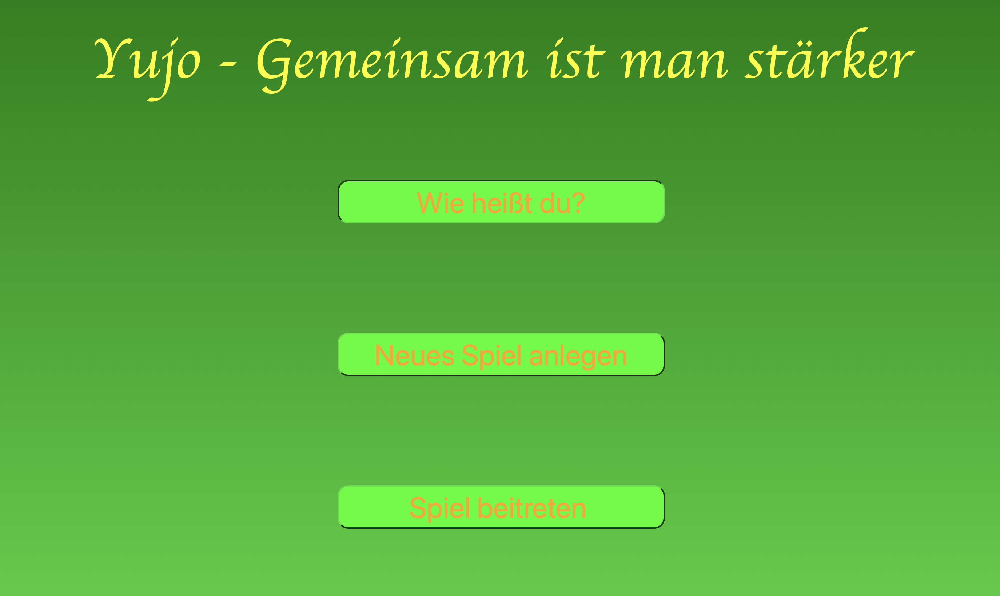
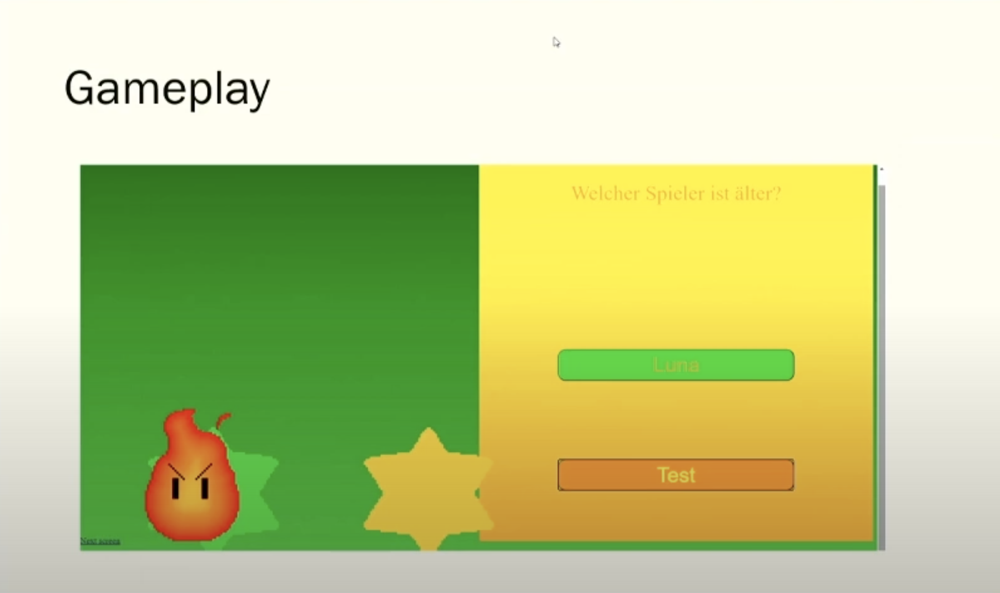
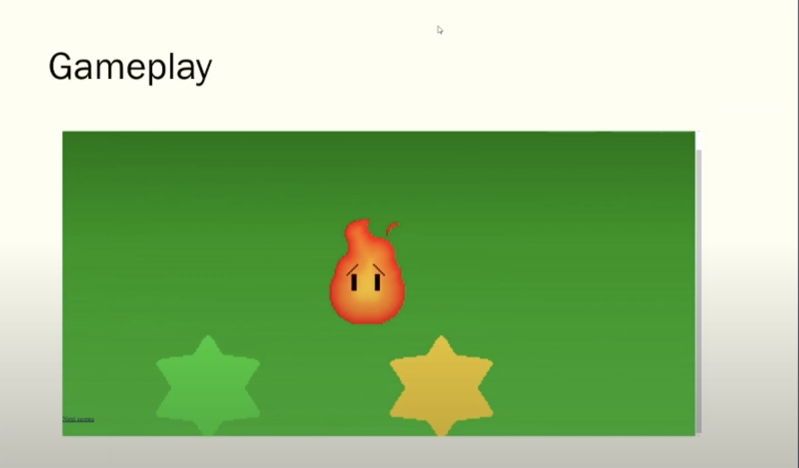

# Yujo - Gemeinsam ist man stärker

Dieses Spiel ist im Rahmen von Jugend Hackt Halle 2020 entstanden.

Yujo ist ein Onlinespiel, mit dem man seine Freunde besser kennenlernen kann - insbesondere geeignet für Zeiten des social distancing.

Die Präsentation zum Spiel findest du hier: https://jugendhackt.org/video/yujo-gemeinsam-spielen/

## Screenshots

## Idee

Es ist ein Spiel in dem man zu zweit mit einem Freund den bösen Feuerball besiegen muss. Nur wenn sich die Freunde gut kennen können sie den Feuerball besiegen.

## Tutorial

Die Regeln sind ganz einfach: Euch wird eine Frage gestellt, und ihr sollt erraten, was der andere antwortet! Gebt ihr beide die gleiche Antwort, dürft ihr den Gegner angreifen. Wenn ihr unterschiedliche Antworten gibt, dürft ihr leider nicht angreifen und die Attacke des Gegners ist stärker. Fallen eure HP auf null, habt ihr verloren.

Viel Glück und mögen die besten Freunde gewinnen!

## Beispiel-Fragen

Welcher Spieler ist älter?

Wer mag die Farbe grün lieber?

Welcher Spieler mag es am liebsten Eis zu essen?

Wer mag es lieber in seiner Freizeit etwas mit seiner Familile zu unternehmen?

Welcher Spieler mag den Sommer mehr?

Wer ist der größere Tierliebhaber?

Wer mag Mathe am liebsten?

Welcher Spieler ist sportlicher?

## Code

Frontend: https://github.com/Jugendhackt/yujo-frontend

Backend: https://github.com/Jugendhackt/yujo-backend

